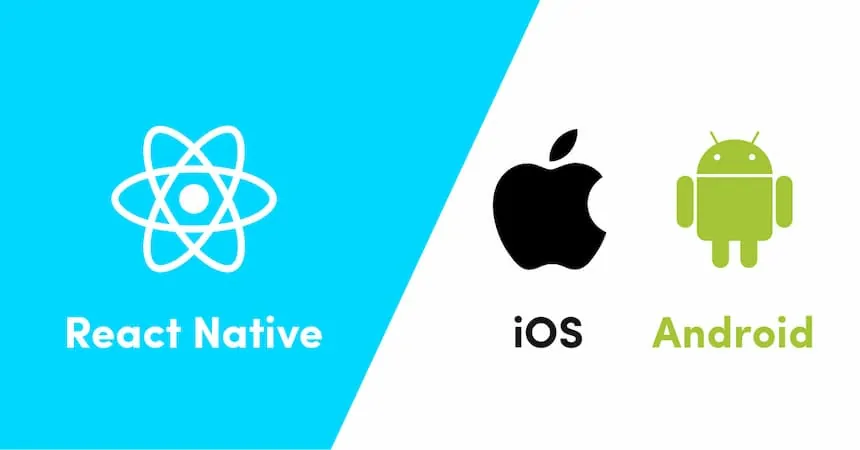

# React Native, Docker and TailwindCSS Quickstart.

React native and Docker Quickstart offers basic configuration you can use to create your own React Native Apps within Docker Containers.

## What you need.

There are some specific things you must need to start building your mobile apps.

1. VS Code installed in your local machine.
2. Install **Dev Containers** VS Code extension.
3. Have Docker installed and running.

## Steps.

In order to run this app in your local enviroment, follow this steps:

1. Clone this repo in your computer.
2. Open this folder with VS Code and run the option: **Rebuild image without cache and reopen in a container**
3. Wait until the container is finished.
4. Enjoy!

## Quick Notes.

By default, the container will open the project using the **jorge** user. You can change it by modifying the Dockerfile and the script.sh, in order to give sudo permissions.

There are some tasks that you have to run using the **sudo** command at the beginning of all command lines.

Visit this Github repo where you can find more information regarding with changing the default username on your dev container: https://github.com/Jorge-Ortiz-Mata/node-16-docker-enviroment
